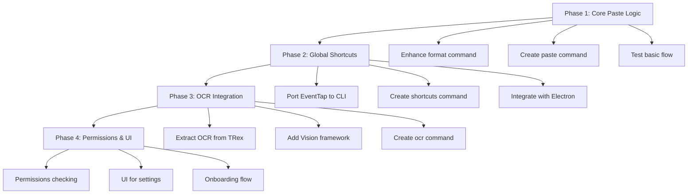

t# AiPaste Electron Implementation Strategy

**Document Version**: 1.0
**Date**: 2025-08-07
**Status**: Draft for Review

---

## Executive Summary

This document outlines the complete implementation strategy for porting AiPaste to Electron while maintaining the core Swift functionality through a CLI bridge. The strategy addresses the critical architectural decisions needed to recreate the original EventTap-based paste interception system using a hybrid Electron + Swift approach.

---

## 1. Clipboard Flow Architecture

### Current State Analysis
- ✅ **Monitor Command**: Works but only detects clipboard changes, doesn't write back
- ✅ **Format Command**: Processes data but outputs to stdout, not clipboard
- ❌ **Paste Integration**: No connection between format and system paste

### Proposed Architecture

```
┌─────────────────┐    ┌──────────────────┐    ┌─────────────────┐
│   User Action   │    │  Keyboard Hook   │    │  Paste Engine   │
│  Cmd+Shift+V    │───▶│  (EventTap)      │───▶│  Format+Paste   │
└─────────────────┘    └──────────────────┘    └─────────────────┘
                                │                        │
                                ▼                        ▼
                       ┌──────────────────┐    ┌─────────────────┐
                       │ Swift CLI Bridge │    │   Application   │
                       │  (format+paste)  │    │  (receives      │
                       └──────────────────┘    │   formatted)    │
                                               └─────────────────┘
```

### Decision: Hybrid Trigger + Monitor System

**Approach**: Combine EventTap shortcuts with selective clipboard monitoring

```swift
// New command structure proposed
struct PasteCommand: ParsableCommand {
    static let configuration = CommandConfiguration(
        commandName: "paste",
        abstract: "Format clipboard and paste with Cmd+V simulation"
    )

    func run() throws {
        // 1. Read clipboard
        // 2. Format if needed
        // 3. Write back to clipboard
        // 4. Simulate Cmd+V
    }
}
```

**Benefits**:
- Clean separation: monitoring vs action
- Better performance: no continuous clipboard writing
- Maintains original UX: instant paste on shortcut

---

## 2. Keyboard Shortcut Implementation

### Analysis: EventTap vs Electron GlobalShortcut

| Approach | Pros | Cons | Recommendation |
|----------|------|------|----------------|
| **EventTap (Swift)** | • Lower level access<br>• Can intercept before apps see it<br>• Exact original behavior | • Requires accessibility permissions<br>• More complex implementation | ✅ **Recommended** |
| **Electron GlobalShortcut** | • Built-in Electron API<br>• Easier to implement<br>• Cross-platform | • Cannot intercept system shortcuts<br>• May conflict with native Cmd+V | ❌ Not suitable |

### Recommended Implementation: EventTap in Swift CLI

**Strategy**: Port EventTap logic to Swift CLI with a dedicated `shortcuts` command

```swift
struct ShortcutsCommand: ParsableCommand {
    static let configuration = CommandConfiguration(
        commandName: "shortcuts",
        abstract: "Monitor for global keyboard shortcuts"
    )

    @Option(name: .short, help: "Key combination (cmd+shift+v)")
    var shortcut: String = "cmd+shift+v"

    func run() throws {
        let eventTap = EventTapWrapper()
        eventTap.setup { proxy, type, event in
            if isTargetShortcut(event, shortcut: shortcut) {
                // Execute paste command
                executeSubcommand(["paste"])
                return nil // Block original event
            }
            return Unmanaged.passRetained(event)
        }

        RunLoop.main.run()
    }
}
```

### Integration with Electron

```typescript
// Start shortcuts monitoring on app launch
export class KeyboardManager {
    private shortcutProcess: ChildProcess | null = null;

    startGlobalShortcuts() {
        this.shortcutProcess = spawn(this.binaryPath, [
            'shortcuts',
            '--shortcut', 'cmd+shift+v'
        ]);

        // Handle shortcut events
        this.shortcutProcess.stdout?.on('data', this.handleShortcutEvent);
    }

    private handleShortcutEvent = (data: Buffer) => {
        // Shortcut was triggered, paste operation completed
        // Send notification to renderer if needed
    }
}
```

---

## 3. Command Structure Redesign

### Current Command Issues
1. **Format command**: Doesn't write to clipboard
2. **Monitor command**: Only detects, doesn't act
3. **No paste command**: Missing the core action

### Proposed Command Structure

```
AiPasteHelper
├── test          (existing - works)
├── format        (existing - enhance to write clipboard)
├── monitor       (existing - works)
├── paste         (NEW - core paste logic)
├── shortcuts     (NEW - global shortcut monitoring)
├── ocr           (NEW - OCR functionality)
└── permissions   (NEW - check/request permissions)
```

### Enhanced Format Command

```swift
struct FormatCommand: ParsableCommand {
    // ... existing options ...

    @Flag(name: .long, help: "Write result back to clipboard")
    var writeClipboard = false

    func run() throws {
        // ... existing logic ...

        if writeClipboard {
            let pasteboard = NSPasteboard.general
            pasteboard.clearContents()
            pasteboard.setString(formatted, forType: .string)
        }

        // Always return JSON for consistency
        let response = CLIResponse(
            success: true,
            message: writeClipboard ? "Formatted and copied" : "Formatted successfully",
            data: formatted
        )
        print(response.toJSON())
    }
}
```

### New Paste Command (Core Logic)

```swift
struct PasteCommand: ParsableCommand {
    static let configuration = CommandConfiguration(
        commandName: "paste",
        abstract: "Smart paste with automatic formatting"
    )

    func run() throws {
        let pasteboard = NSPasteboard.general
        var shouldFormat = false
        var content = ""

        // Check for HTML table content (Excel/Sheets)
        if let htmlData = pasteboard.data(forType: .html),
           let htmlString = String(data: htmlData, encoding: .utf8) {
            if htmlString.contains("<table") || htmlString.contains("google-sheets-html-origin") {
                shouldFormat = true
                content = htmlString
            }
        }

        // Check for tab-delimited content
        if !shouldFormat, let plainText = pasteboard.string(forType: .string) {
            if plainText.contains("\t") {
                shouldFormat = true
                content = plainText
            }
        }

        if shouldFormat {
            // Format the content
            let formatter = TableFormatter()
            let formatted = formatter.createPasteableContent(
                content,
                isHTML: content.contains("<"),
                outputFormat: "simple"
            )

            // Write back to clipboard
            pasteboard.clearContents()
            pasteboard.setString(formatted, forType: .string)
        }

        // Simulate Cmd+V (from original AppDelegate.swift)
        performSystemPaste()

        let response = CLIResponse(
            success: true,
            message: shouldFormat ? "Formatted and pasted" : "Pasted normally",
            data: nil
        )
        print(response.toJSON())
    }

    private func performSystemPaste() {
        // Exact logic from original AppDelegate.swift line 121-140
        guard let source = CGEventSource(stateID: .hidSystemState) else { return }

        let vKey: CGKeyCode = 0x09

        if let keyDown = CGEvent(keyboardEventSource: source, virtualKey: vKey, keyDown: true) {
            keyDown.flags = .maskCommand
            keyDown.post(tap: .cghidEventTap)
        }

        if let keyUp = CGEvent(keyboardEventSource: source, virtualKey: vKey, keyDown: false) {
            keyUp.flags = .maskCommand
            keyUp.post(tap: .cghidEventTap)
        }
    }
}
```

---

## 4. Process Architecture

### Current Process Model Issues
- **Monitor**: Long-running, but only detects changes
- **No coordination**: Commands run independently
- **No state sharing**: Each command starts fresh

### Proposed Architecture: Multiple Specialized Processes

```
┌─────────────────────────────────────────────────────────────┐
│                    Electron Main Process                    │
├─────────────────────────────────────────────────────────────┤
│                                                             │
│  ┌─────────────────┐  ┌─────────────────┐  ┌──────────────┐ │
│  │   SwiftBridge   │  │ KeyboardManager │  │ PermissionsMgr│ │
│  │                 │  │                 │  │              │ │
│  └─────────┬───────┘  └─────────┬───────┘  └──────┬───────┘ │
│            │                    │                 │         │
└────────────┼────────────────────┼─────────────────┼─────────┘
             │                    │                 │
             ▼                    ▼                 ▼
  ┌─────────────────┐   ┌─────────────────┐   ┌─────────────┐
  │ AiPasteHelper   │   │ AiPasteHelper   │   │AiPasteHelper│
  │    monitor      │   │   shortcuts     │   │permissions  │
  │                 │   │                 │   │             │
  │ (long-running)  │   │ (long-running)  │   │ (one-shot)  │
  └─────────────────┘   └─────────────────┘   └─────────────┘
```

### Process Management Strategy

```typescript
export class ProcessManager {
    private processes = new Map<string, ChildProcess>();

    async startAllServices() {
        // Start clipboard monitor
        await this.startProcess('monitor', ['monitor']);

        // Start global shortcuts
        await this.startProcess('shortcuts', ['shortcuts']);

        // Check permissions
        const perms = await this.checkPermissions();
        if (!perms.accessibility) {
            // Handle permission request
        }
    }

    private async startProcess(name: string, args: string[]) {
        const process = spawn(this.binaryPath, args);

        process.on('exit', (code) => {
            logError(`Process ${name} exited with code ${code}`);
            // Implement restart logic if needed
        });

        this.processes.set(name, process);
    }

    async executeOneShot(args: string[]): Promise<CLIResponse> {
        // For commands like format, paste, permissions check
        return this.swiftBridge.execute(args);
    }
}
```

---

## 5. Standard Implementation Pattern

### Port Guidelines from Original Swift

Based on analysis of the original codebase, here's the standard pattern:

#### 1. Exact Logic Porting
```swift
// ✅ Good: Direct port from PasteManager.swift
func convertHTMLToPlainText(_ html: String) throws -> String {
    let document = try SwiftSoup.parse(html)
    guard let body = document.body() else { return "" }
    // ... exact same logic ...
}
```

#### 2. Consistent JSON Communication
```swift
// ✅ Standard response format
struct CLIResponse: Codable {
    let success: Bool
    let message: String?
    let data: String?
    let error: String?
    let event: String?  // For long-running processes
}
```

#### 3. Error Handling Pattern
```swift
func run() throws {
    do {
        let result = try performOperation()
        let response = CLIResponse(success: true, data: result)
        print(response.toJSON())
    } catch {
        let response = CLIResponse(success: false, error: error.localizedDescription)
        print(response.toJSON())
    }
}
```

#### 4. TypeScript Integration Pattern
```typescript
// ✅ Standard TypeScript wrapper
async function executeSwiftCommand(command: string, args: any[]): Promise<any> {
    try {
        const result = await swiftBridge.execute([command, ...args]);
        if (!result.success) {
            throw new Error(result.error || 'Command failed');
        }
        return result.data;
    } catch (error) {
        logError(`Swift command ${command} failed:`, error);
        throw error;
    }
}
```

---

## 6. Feature Priority and Dependencies

### Implementation Phases



### Detailed Implementation Order

#### Phase 1: Core Paste Logic (Estimated: 1-2 sessions)
**Dependencies**: None (builds on existing foundation)

1. **Enhance format command** (Priority: Critical)
   - Add `--write-clipboard` flag
   - Ensure clipboard write functionality works
   - Test with Excel/Google Sheets

2. **Create paste command** (Priority: Critical)
   - Implement smart detection (HTML tables, tab-delimited)
   - Port clipboard read/write logic
   - Add system paste simulation (Cmd+V generation)

3. **Update TypeScript bridge** (Priority: High)
   - Add paste command support
   - Add keyboard manager class
   - Test end-to-end flow

#### Phase 2: Global Shortcuts (Estimated: 2-3 sessions)
**Dependencies**: Phase 1 must be complete and tested

1. **Port EventTap wrapper** (Priority: Critical)
   - Extract EventTapWrapper from original project
   - Adapt for CLI environment
   - Add proper error handling

2. **Create shortcuts command** (Priority: Critical)
   - Implement global keyboard monitoring
   - Add configurable key combinations
   - Connect to paste command

3. **Process management** (Priority: High)
   - Handle long-running shortcuts process
   - Implement restart logic
   - Add status monitoring

#### Phase 3: OCR Integration (Estimated: 2-3 sessions)
**Dependencies**: Phases 1 & 2 complete

1. **Extract OCR logic** (Priority: High)
   - Port from TRex AiPasteCore.swift
   - Add Vision framework imports
   - Create ocr command

2. **Screen capture integration** (Priority: High)
   - Add screenshot capabilities
   - Integrate with OCR processing
   - Test with various image formats

#### Phase 4: Permissions & Polish (Estimated: 1-2 sessions)
**Dependencies**: Core functionality complete

1. **Permissions system** (Priority: Medium)
   - Check accessibility permissions
   - Check screen recording permissions
   - Add permission request flow

2. **UI enhancements** (Priority: Low)
   - Settings window
   - Onboarding flow
   - Status indicators

---

## 7. Testing Strategy

### Testing Pyramid

```
                    ┌─────────────────┐
                    │   E2E Tests     │ ← Real user workflows
                    │  (Manual/Auto)  │
                ┌───┴─────────────────┴───┐
                │   Integration Tests     │ ← Swift CLI + Electron
                │   (Automated)          │
            ┌───┴─────────────────────────┴───┐
            │        Unit Tests               │ ← Individual commands
            │      (Swift + TS)              │
        ┌───┴─────────────────────────────────┴───┐
        │           Manual Testing                │ ← Real Excel/Sheets
        └─────────────────────────────────────────┘
```

### Phase-by-Phase Testing

#### Phase 1: Core Paste Testing
```bash
# Unit tests for format command
./.build/debug/AiPasteHelper format --input "col1\tcol2\nrow1\trow2" --write-clipboard

# Integration test with real clipboard
# 1. Copy table from Excel
# 2. Run paste command
# 3. Verify formatted result
./.build/debug/AiPasteHelper paste
```

#### Phase 2: Shortcuts Testing
```bash
# Test shortcut detection
./.build/debug/AiPasteHelper shortcuts --shortcut "cmd+shift+v"

# Integration test:
# 1. Start shortcuts process
# 2. Copy table from Excel
# 3. Press Cmd+Shift+V
# 4. Verify formatted paste in target app
```

#### Phase 3: OCR Testing
```bash
# Test OCR on sample images
./.build/debug/AiPasteHelper ocr --input "/path/to/screenshot.png"

# Integration with shortcuts:
# 1. Take screenshot with tables
# 2. Press OCR shortcut
# 3. Verify extracted table data
```

### Automated Testing Framework

```typescript
// Integration test example
describe('Swift CLI Integration', () => {
    test('format command with clipboard write', async () => {
        const input = "Name\tAge\nJohn\t25\nJane\t30";
        const result = await swiftBridge.execute(['format', '--input', input, '--write-clipboard']);

        expect(result.success).toBe(true);
        expect(result.message).toContain('Formatted and copied');

        // Verify clipboard contains formatted result
        const clipboardContent = await clipboard.readText();
        expect(clipboardContent).toContain('|');
    });

    test('paste command end-to-end', async () => {
        // Setup: put table data in clipboard
        await clipboard.writeText("col1\tcol2\nval1\tval2");

        const result = await swiftBridge.execute(['paste']);
        expect(result.success).toBe(true);

        // Verify formatted data was pasted (would need integration with test app)
    });
});
```

---

## 8. Risk Mitigation

### High-Risk Areas

#### Risk 1: EventTap Permissions
**Impact**: High - Core functionality blocked
**Probability**: Medium - macOS security restrictions

**Mitigation Strategy**:
1. Clear permission request flow in onboarding
2. Fallback to Electron globalShortcut for basic functionality
3. Detailed documentation for users
4. Test on clean macOS installations

#### Risk 2: Clipboard Race Conditions
**Impact**: Medium - Intermittent paste failures
**Probability**: Low - Well-tested in original app

**Mitigation Strategy**:
1. Port exact timing logic from original
2. Add retry mechanisms for clipboard operations
3. Comprehensive integration testing

#### Risk 3: Performance with Large Tables
**Impact**: Medium - User experience degradation
**Probability**: Low - Already handled in original

**Mitigation Strategy**:
1. Port existing performance optimizations
2. Add streaming for very large datasets
3. Performance testing with real-world data

### Monitoring and Rollback

```typescript
// Health monitoring for Swift processes
export class HealthMonitor {
    private healthChecks = new Map<string, Date>();

    async checkProcessHealth() {
        // Test each Swift command
        const testResult = await swiftBridge.test();
        if (!testResult) {
            await this.restartSwiftProcesses();
        }
    }

    private async restartSwiftProcesses() {
        logError('Swift processes unhealthy, restarting...');
        processManager.stopAllProcesses();
        await processManager.startAllServices();
    }
}
```

---

## 9. Implementation Checkpoints

### Phase 1 Completion Criteria
- [ ] Format command writes to clipboard successfully
- [ ] Paste command detects and formats table data
- [ ] System paste simulation works (Cmd+V generation)
- [ ] TypeScript bridge handles new commands
- [ ] Integration test with Excel passes

### Phase 2 Completion Criteria
- [ ] EventTap successfully intercepts Cmd+Shift+V
- [ ] Shortcuts process runs stably as daemon
- [ ] Original shortcut is blocked (no double-paste)
- [ ] Permission errors handled gracefully
- [ ] Full paste flow works end-to-end

### Phase 3 Completion Criteria
- [ ] OCR extracts text from screenshots
- [ ] OCR integrates with table formatting
- [ ] Screen capture works reliably
- [ ] Performance acceptable (<2s for typical screenshots)

### Phase 4 Completion Criteria
- [ ] All permissions checked and requested properly
- [ ] Settings UI allows shortcut customization
- [ ] Onboarding guides users through setup
- [ ] Error handling provides clear user feedback

---

## 10. Success Metrics

### Functional Metrics
- **Paste accuracy**: >95% correct formatting on Excel/Sheets tables
- **Performance**: <200ms from shortcut to formatted paste
- **Reliability**: <1% failure rate on supported data formats
- **Permission success**: >90% of users complete setup successfully

### Technical Metrics
- **Process stability**: >99.9% uptime for background processes
- **Memory usage**: <50MB total for all Swift processes
- **CPU usage**: <5% during active paste operations
- **Error rate**: <0.1% for core paste operations

---

## Conclusion

This implementation strategy provides a clear path to recreate AiPaste's core functionality in Electron while maintaining the performance and reliability of the original Swift implementation. The hybrid architecture leverages the strengths of both platforms: Electron's UI capabilities and Swift's native macOS integration.

The phased approach ensures that each component builds upon proven foundations, with comprehensive testing at each stage. The focus on exact logic porting from the original codebase minimizes the risk of introducing new bugs while adapting to the new architecture.

Key success factors:
1. **Maintain original UX**: EventTap-based shortcuts with instant paste
2. **Preserve all functionality**: Exact table formatting logic
3. **Ensure reliability**: Robust error handling and process management
4. **Plan for scale**: Modular architecture supporting future features

The next step is to begin Phase 1 implementation, starting with enhancing the format command to write clipboard data.