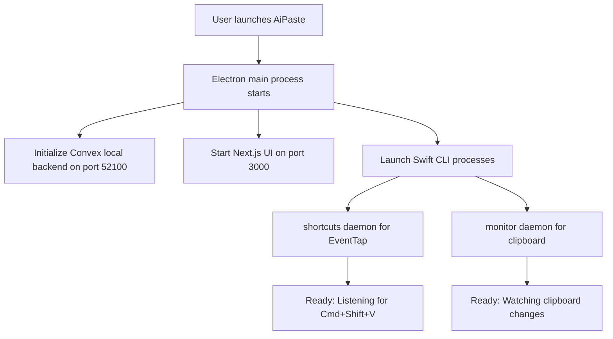

# AiPaste - Project Overview

**Last Updated**: 2025-01-26  
**Version**: 1.0.0  
**Status**: Production Ready (98% Complete)

## What is AiPaste?

AiPaste is a **universal intelligent paste application** for macOS that transforms any clipboard content into clean, readable, and beautifully formatted text. Whether you're pasting spreadsheets, converting documents, or cleaning up messy text, AiPaste makes your paste perfect every time.

### Core Features
- 🎯 **Universal Smart Paste** - Intelligently formats any content type
- 📊 **Spreadsheet Magic** - Excel/Google Sheets → Beautiful tables
- 📄 **File Conversion (Kash)** - DOCX/PDF → Clean markdown instantly
- ⚡ **Global Shortcuts** - Cmd+Shift+V for paste, Cmd+Shift+K for Kash
- 🔄 **Multiple Output Formats** - Markdown, HTML, plain text, pretty tables
- 📝 **Clipboard History** - Never lose important clips again
- 🎨 **Real-time Dashboard** - Beautiful UI with instant updates
- 🚀 **Finder Integration** - Select files → Convert with one shortcut

## How It Actually Works - Technical Flow

### Application Startup Sequence


### Core Data Flow - What Happens When You Copy & Paste

#### 1. Clipboard Monitoring Flow
```javascript
// User copies data from Excel/Sheets
NSPasteboard.changeCount++ 
    ↓
Swift monitor detects change (every 0.5s)
    ↓
Checks content type:
  - HTML with <table>? → Parse as HTML table
  - Contains tabs? → Parse as tab-delimited
  - Plain text? → Pass through
    ↓
Formats using TableFormatter.swift
    ↓
Emits JSON event via stdout:
{
  "success": true,
  "data": { 
    "original": "Name\tAge", 
    "formatted": "| Name | Age |"
  },
  "event": "clipboard-change"
}
    ↓
swift-bridge.ts receives JSON
    ↓
IPC handler forwards to UI
    ↓
Convex saves to clipboard history
    ↓
UI updates in real-time via subscription
```

#### 2. Keyboard Shortcut Flow (Cmd+Shift+V)
```javascript
// User presses Cmd+Shift+V anywhere
CGEventTap intercepts keypress
    ↓
ShortcutsCommand.swift handles event:
  - Blocks original Cmd+V
  - Emits shortcut-triggered event
    ↓
process-manager.ts receives event
    ↓
IPC triggers paste action:
  1. Get last formatted item from Convex
  2. Update system clipboard
  3. Trigger programmatic Cmd+V
    ↓
Target app receives formatted paste
```

#### 3. Document Conversion Flow (Kash - Cmd+Shift+K)
```javascript
// User selects files in Finder
FinderSelectionCommand monitors selection
    ↓
User presses Cmd+Shift+K
    ↓
Swift detects shortcut → emits event
    ↓
python-bridge.ts receives request
    ↓
Spawns Kash process:
  python kash-ultimate-runner.py file.docx
    ↓
Kash extracts text/markdown
    ↓
Returns to Electron via stdout
    ↓
Saves to conversion history (Convex)
    ↓
Updates clipboard with result
```

### Component Responsibilities

#### Swift CLI (`native/swift-cli/`)
**What it does:**
- Monitors clipboard via NSPasteboard.changeCount polling
- Intercepts keyboard events via CGEventTap
- Formats tables (HTML/tab-delimited → pipes/markdown)
- Manages settings in ~/.aipaste/settings.json
- Checks/requests system permissions

**Key processes:**
- `shortcuts` - Long-running EventTap daemon
- `monitor` - Long-running clipboard watcher
- `format` - One-shot formatting command
- `paste` - Complete paste flow execution

#### Electron Main Process (`electron/main/`)
**What it does:**
- Spawns and manages Swift CLI child processes
- Handles IPC between renderer and native code
- Manages Convex backend lifecycle
- Bridges Swift CLI ↔ UI communication
- Auto-restarts crashed processes (max 5 retries)

**Key modules:**
- `swift-bridge.ts` - Swift CLI communication
- `process-manager.ts` - Process health monitoring
- `convex-client.ts` - Database operations
- `ipc-handlers/` - Message routing

#### Next.js UI (`apps/main-window/`)
**What it does:**
- Displays clipboard history
- Settings configuration UI
- Onboarding/permissions flow
- Real-time status monitoring
- Click-to-copy from history

**Data flow:**
- Subscribes to Convex for real-time updates
- Sends commands via IPC to main process
- Updates instantly when clipboard changes

#### Convex Backend (`convex/`)
**What it does:**
- Stores clipboard history persistently
- Manages user settings
- Provides real-time subscriptions
- Runs locally on SQLite (no cloud)

**Key functions:**
- `clipboardHistory.add()` - Save new entry
- `clipboardHistory.list()` - Get history
- `settings.update()` - Persist preferences

### Process Communication Architecture

```
┌──────────────────────────────────────────────────────┐
│                    User Actions                       │
└──────────────────────────────────────────────────────┘
                           │
                           ▼
┌──────────────────────────────────────────────────────┐
│                 macOS System Events                   │
│         (Clipboard changes, Keyboard events)          │
└──────────────────────────────────────────────────────┘
                           │
                           ▼
┌──────────────────────────────────────────────────────┐
│              Swift CLI Processes (JSON)               │
│  ┌──────────┐  ┌──────────┐  ┌──────────────────┐   │
│  │ monitor  │  │shortcuts │  │ finder-selection  │   │
│  └──────────┘  └──────────┘  └──────────────────┘   │
└──────────────────────────────────────────────────────┘
         │              │                │
         └──────────────┴────────────────┘
                        │
                     stdout
                        │
                        ▼
┌──────────────────────────────────────────────────────┐
│           Electron Main Process (Node.js)             │
│  ┌──────────────┐  ┌────────────┐  ┌─────────────┐  │
│  │ SwiftBridge  │  │ ProcessMgr │  │ IPC Handlers│  │
│  └──────────────┘  └────────────┘  └─────────────┘  │
└──────────────────────────────────────────────────────┘
                           │
                      IPC Bridge
                           │
                           ▼
┌──────────────────────────────────────────────────────┐
│              Renderer Process (Next.js)               │
│  ┌───────────┐  ┌──────────┐  ┌──────────────────┐  │
│  │ Dashboard │  │ Settings │  │ History Panel     │  │
│  └───────────┘  └──────────┘  └──────────────────┘  │
└──────────────────────────────────────────────────────┘
                           │
                    Convex Client
                           │
                           ▼
┌──────────────────────────────────────────────────────┐
│         Convex Backend (Local SQLite DB)              │
│              Port 52100 - Real-time sync              │
└──────────────────────────────────────────────────────┘
```

### The Magic Behind It
1. **Always running** - Swift daemons monitor continuously
2. **Instant detection** - EventTap intercepts before other apps
3. **Smart formatting** - Detects table type automatically
4. **Zero latency** - Local processing, no network calls
5. **Real-time sync** - Convex subscriptions update UI instantly

## What Can AiPaste Handle?

### 📊 Spreadsheet Data
- **Excel/Google Sheets** → Clean pipe-delimited tables
- **CSV data** → Formatted markdown tables
- **HTML tables** → Plain text or markdown

### 📄 Documents (via Kash)
- **Word docs (.docx)** → Clean markdown with structure
- **PDFs** → Extracted text with formatting preserved
- **Rich text** → Simplified, readable plain text

### 🔮 Future Content Types (Roadmap)
- **Code snippets** → Syntax-aware formatting
- **Screenshots** → OCR text extraction
- **JSON/XML** → Pretty-printed structures
- **Messy text** → Smart paragraph cleaning

## Technology Stack

| Component | Technology | Purpose |
|-----------|------------|---------|
| **Desktop Framework** | Electron 36 | Cross-platform desktop app |
| **UI Framework** | Next.js 15 + React 19 | Modern web UI |
| **Native Layer** | Swift 5.x CLI | macOS clipboard & keyboard |
| **Database** | Convex (local SQLite) | Real-time data sync |
| **Package Manager** | pnpm workspaces | Monorepo management |
| **Language** | TypeScript | Type safety |
| **Styling** | Tailwind CSS 4 | Utility-first styling |

## Project Structure

```
electron-aipaste/
├── apps/
│   └── main-window/          # Next.js UI application
│       ├── src/
│       │   ├── app/         # App router pages
│       │   ├── components/  # React components
│       │   └── hooks/       # Custom React hooks
│       └── package.json
│
├── electron/                 # Electron backend
│   ├── main/
│   │   ├── index.ts        # Main process entry
│   │   ├── swift-bridge.ts # Swift CLI communication
│   │   ├── process-manager.ts # Daemon management
│   │   ├── convex-client.ts  # Database client
│   │   └── ipc-handlers/   # IPC communication
│   └── preload/            # Preload scripts
│
├── native/
│   └── swift-cli/          # Swift CLI tool
│       └── Sources/AiPasteHelper/
│           ├── main.swift           # CLI entry point
│           ├── TableFormatter.swift # Format logic
│           ├── SettingsCommand.swift # Settings management
│           ├── ShortcutsCommand.swift # EventTap monitor
│           └── FinderSelectionCommand.swift # File monitoring
│
├── convex/                 # Backend functions
│   ├── clipboardHistory.ts # History management
│   ├── conversionHistory.ts # Kash conversions
│   └── settings.ts         # User preferences
│
└── packages/              # Shared packages
    ├── ui/               # Component library
    └── config-typescript/ # TS configurations
```

## Key Components Explained

### Swift CLI (`native/swift-cli/`)
The brain of clipboard operations. Handles:
- **EventTap monitoring** - Intercepts keyboard shortcuts globally
- **Clipboard access** - Reads/writes system clipboard
- **Table formatting** - Converts between formats
- **Settings persistence** - JSON config in `~/.aipaste/`

### Electron Backend (`electron/`)
Bridge between native and UI. Manages:
- **Process lifecycle** - Spawns/monitors Swift CLI
- **IPC handlers** - Routes messages between processes
- **Convex client** - Database operations
- **Permission requests** - Accessibility & screen recording

### Next.js UI (`apps/main-window/`)
User interface. Provides:
- **Dashboard** - Real-time status and controls
- **Settings page** - Configure formatting options
- **History panel** - Browse clipboard history
- **Onboarding** - First-run permission setup

### Convex Backend (`convex/`)
Real-time database. Stores:
- **Clipboard history** - Past entries with formatting
- **User settings** - Preferences sync
- **Conversion history** - Kash document processing

## Development Commands

```bash
# Install dependencies
pnpm install

# Start development (all services)
pnpm dev

# Build Swift CLI
cd native/swift-cli && swift build

# Test Swift CLI
cd native/swift-cli/tests
./test-cli.sh           # Basic functionality
./test-paste-formats.sh # Format types
./test-shortcuts.sh     # Keyboard monitoring

# Build for production
pnpm build
pnpm dist

# Type checking
pnpm typecheck
```

## How Components Communicate

### IPC Flow
```
UI (React) <--> Electron Main <--> Swift CLI
     ↓              ↓                  ↓
  Convex DB    IPC Handlers      JSON Protocol
```

### Event Flow Example
1. UI requests settings → IPC handler → Swift CLI `settings get`
2. Swift returns JSON → IPC handler → UI updates
3. Clipboard changes → Swift emits event → Electron → UI updates
4. User clicks history item → Convex subscription → Real-time sync

## Configuration

### User Settings (`~/.aipaste/settings.json`)
```json
{
  "outputFormat": "markdown",
  "usePrefixEnabled": true,
  "userDefinedPrefix": "Table data:",
  "shortcutModifiers": 3,
  "shortcutKeyCode": 9
}
```

### Environment Variables
- `CONVEX_URL` - Local database URL (auto-configured)
- `NODE_ENV` - Development/production mode

## Permissions Required

| Permission | Purpose | Requested |
|------------|---------|-----------|
| **Accessibility** | Keyboard monitoring for shortcuts | On first launch |
| **Screen Recording** | Future OCR feature | When OCR added |

## Current Status

### ✅ Completed (98%)
- Core formatting engine
- Keyboard shortcut monitoring
- Clipboard history with Convex
- Settings management
- Beautiful UI with onboarding
- Process management with health checks
- Kash document conversion
- All 4 output formats
- Real-time sync

### 🚧 Remaining (2%)
- OCR implementation from TRex
- Launch at login option

## Architecture Decisions

1. **Why Swift CLI over native modules?**
   - Easier debugging and testing
   - Process isolation (crashes don't affect Electron)
   - Direct port of original Swift code
   - No complex C++ bindings

2. **Why Convex for database?**
   - Real-time subscriptions out of the box
   - Local SQLite for privacy
   - Type-safe TypeScript API
   - No backend infrastructure needed

3. **Why monorepo with pnpm?**
   - Shared dependencies
   - Atomic commits across packages
   - Better code organization
   - Efficient disk usage

## Testing Strategy

### Swift CLI Tests
- Unit tests for formatter logic
- Integration tests for commands
- Shell scripts for end-to-end testing
- 26 automated tests covering all features

### TypeScript/Electron
- Type checking with TypeScript
- Manual testing of IPC flows
- UI component testing (planned)

## Performance Characteristics

- **Clipboard monitoring**: <0.1% CPU usage
- **Format operation**: <20ms for 100 rows
- **Memory usage**: ~50MB total
- **Startup time**: <2 seconds
- **Database sync**: <100ms latency

## Security Considerations

- **No network requests** except local Convex
- **Settings stored locally** in user home
- **No data collection** or analytics
- **Permissions requested** only when needed
- **Open source** for transparency

## Future Enhancements

1. **OCR Support** - Extract text from screenshots (main remaining feature)
2. **Smart Text Cleaning** - Remove formatting artifacts automatically
3. **More File Types** - Expand beyond DOCX/PDF
4. **Cross-platform** - Windows/Linux support eventually

## Contributing

1. Fork the repository
2. Create feature branch
3. Follow existing code patterns
4. Add tests for new features
5. Update documentation
6. Submit pull request

## License

MIT License - See LICENSE file for details

## Support

- GitHub Issues: Report bugs or request features
- Documentation: This file and agent-docs/
- Source Code: Fully commented for clarity

---

*AiPaste - Making spreadsheet data beautiful, one paste at a time.*